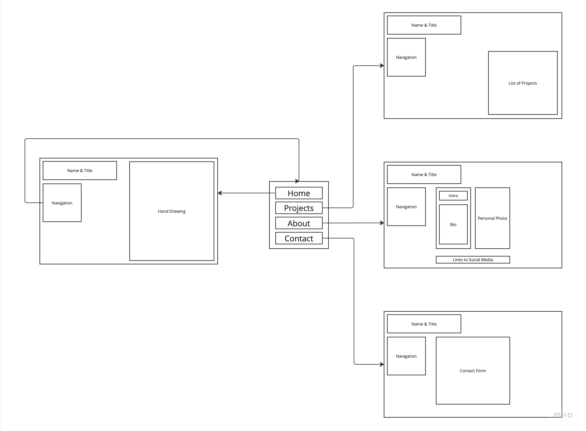
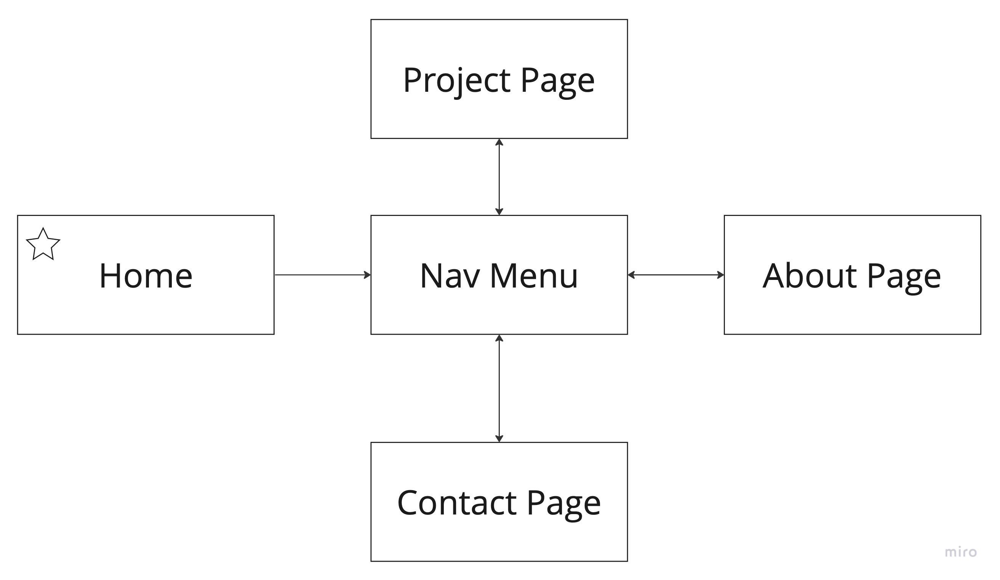
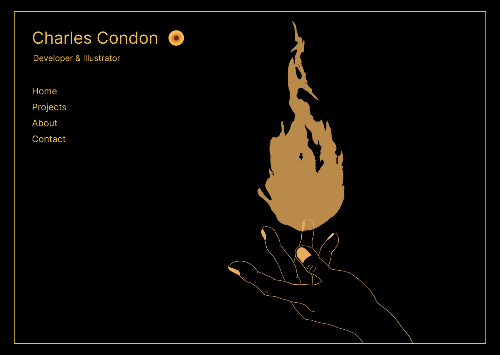
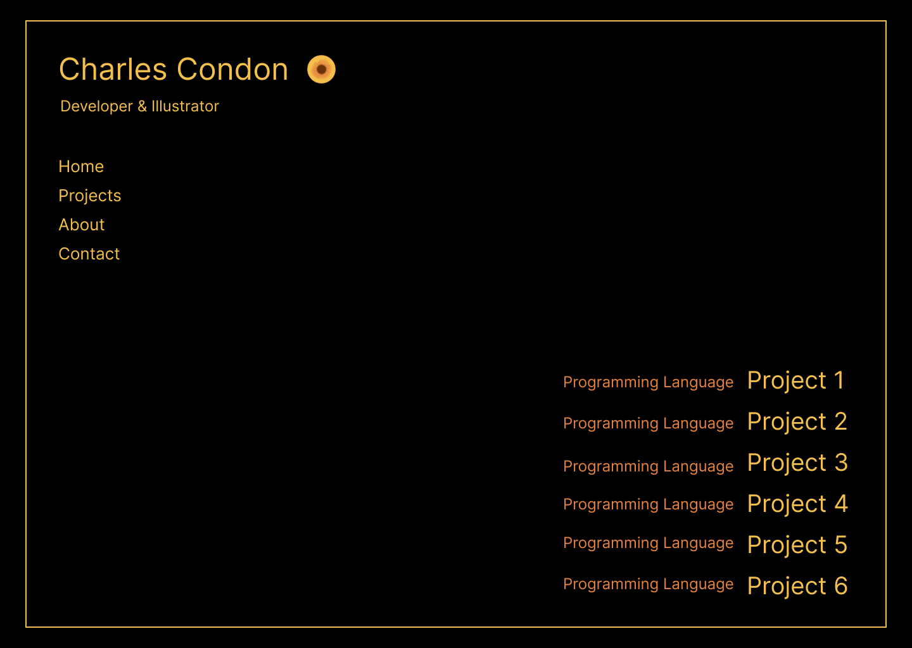
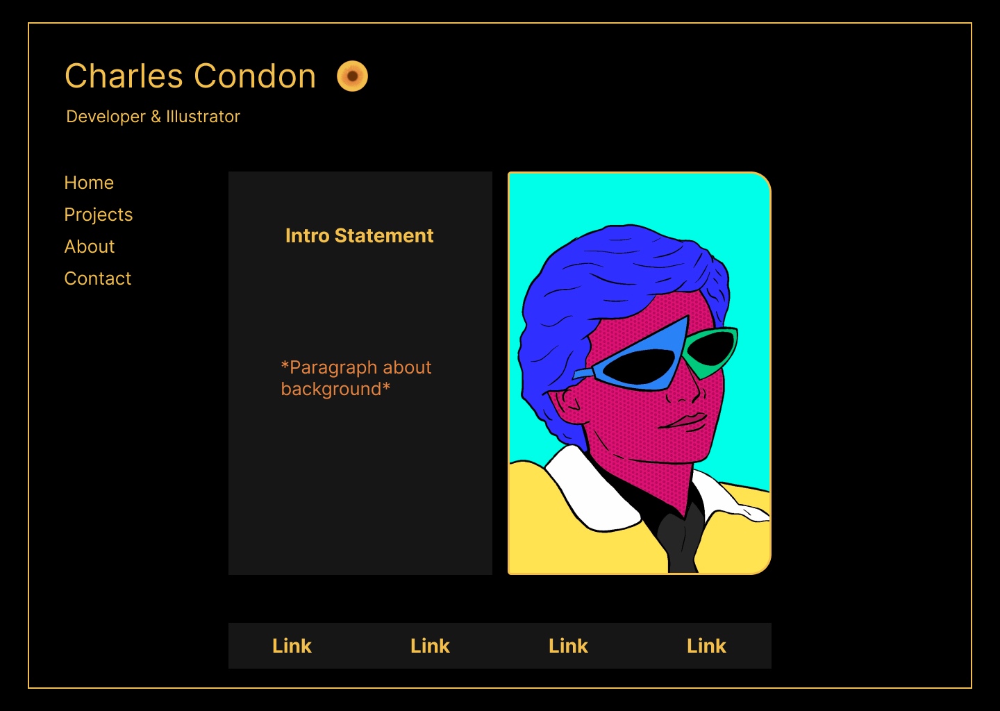
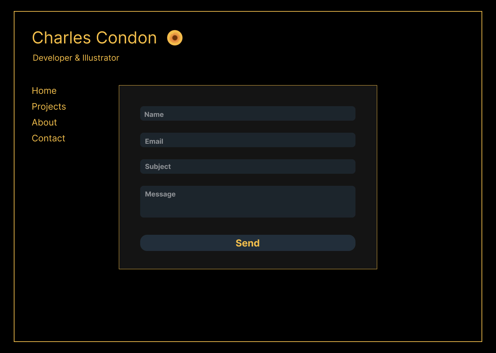
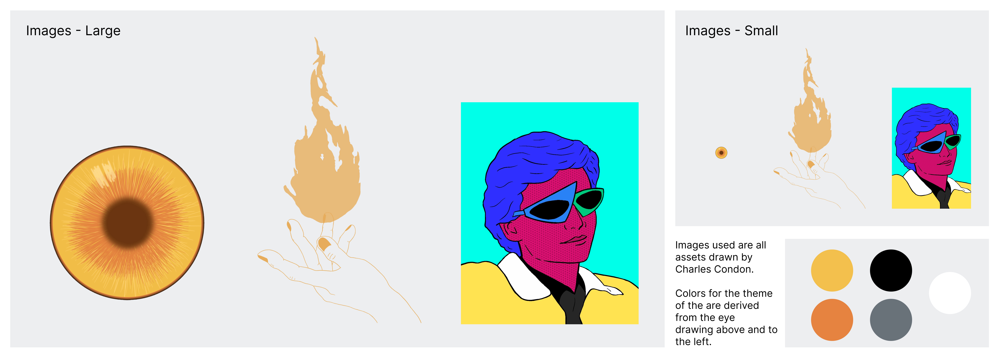
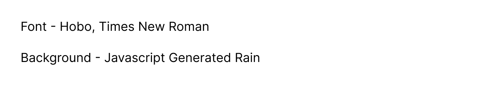

# User Experience Design

Click [here](https://www.figma.com/proto/LvgwfJFCCY546S3l1uhxEs/Portfolio?node-id=1-2&scaling=min-zoom&page-id=0%3A1&starting-point-node-id=1%3A2) to view the interactive prototype.

## Wireframes & Prototype

#### Wireframe

     
      Entire wireframe displaying all possible user screens

#### App Map

     
      Entire app map displaying all possible user screens

### Prototype

#### Home Page

  
   

#### Project Page

  
   

#### About Page

  
   

#### Contact Page

  
   

### Digital Assets

  
   

### Additional Details

  
   

